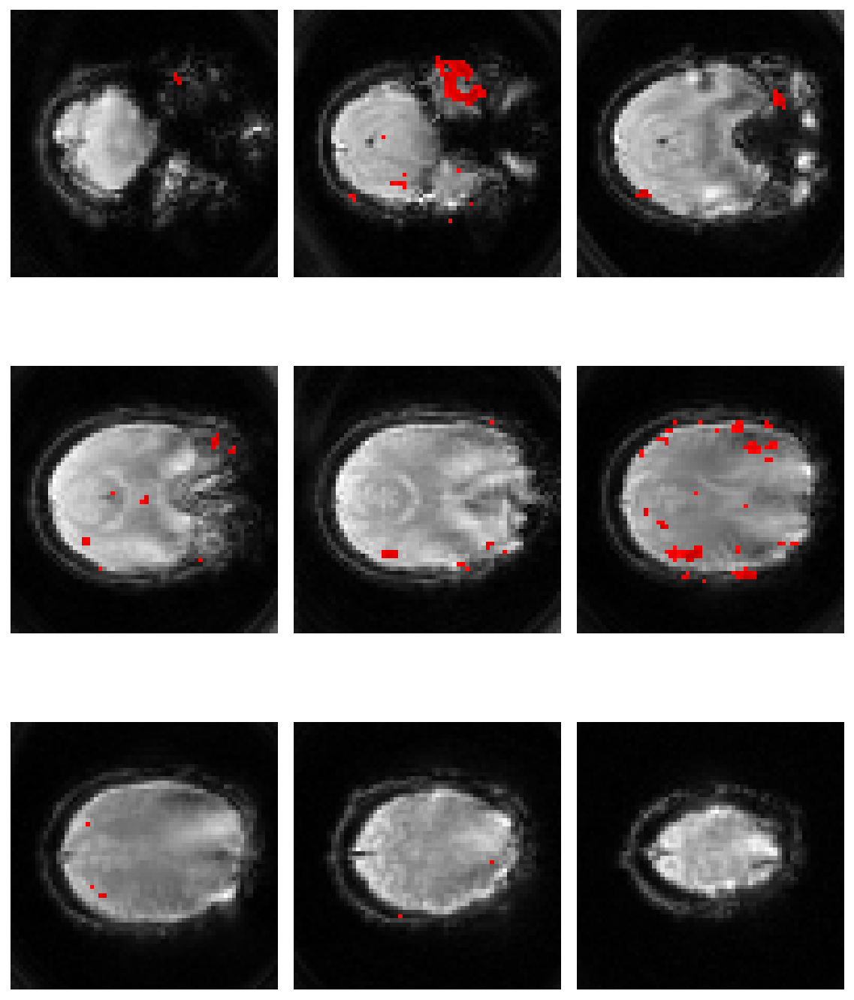

### I am able to visualize data in different ways

#### Here is an example where I used different functions to perform image analysis

    plt.imshow(ndi.rotate(vol[:, :, 79], angle = 180), cmap='gray')
    plt.axis('off')
    plt.show()

### Here is an example of using seaborn to visualize data

    # Error rate barplot showing simon and flanker conditions
    sns.catplot(kind = 'bar', data = df, y = 'error', hue = 'simon', x = 'flankers', palette = 'colorblind', ci=None)
    plt.title('Figure 2 (ERROR RATE)')
    plt.show()

#### This is how I can use subplots to further organize my data visualization

    fig = plt.figure(figsize = [8, 12])
    subplot_counter = 1

    # Loop through subplots and draw an image 
    for ii in range (0, 160, 10): 
        fig.add_subplot(4, 4, subplot_counter) 
        plt.imshow(vol[ii], cmap='gray')
        plt.axis('off')
        plt.tight_layout()
        subplot_counter += 1 
    #render the figure 
    plt.show()
    
    

#### I am also able to mask different images

    brain_mask = np.where(brain_img > 125, 1, 0)
    plt.imshow(brain_mask, cmap='gray')
    plt.axis('off')
    plt.show()
    
    

#### Finally, I can overlay colormaps

    thresh_zstat= np.where(fmri_zstat_data > z_thresh, fmri_zstat_data, np.nan)
    fig = plt.figure(figsize=[8, 12])
    subplot_counter = 1

    for ii in range(0,27,3):
        fig.add_subplot(3,3,subplot_counter)
        plt.imshow(underlay[:,:,ii],cmap= 'gray')
        plt.imshow(thresh_zstat[:,:,ii],
                   cmap='seismic', vmin= -8,
                   vmax= 8)
        plt.axis('off')
        plt.tight_layout()
        subplot_counter += 1 
        
    plt.show()

